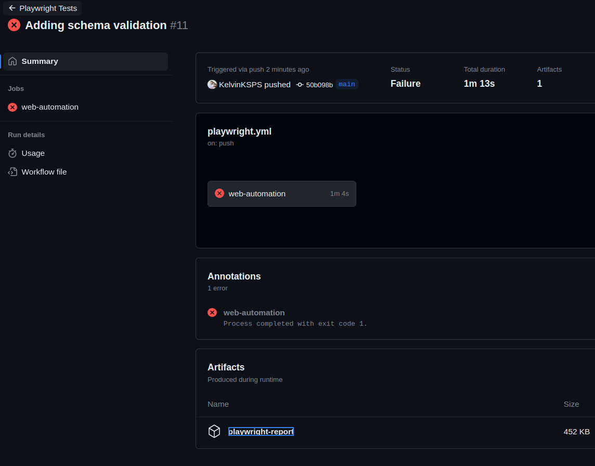
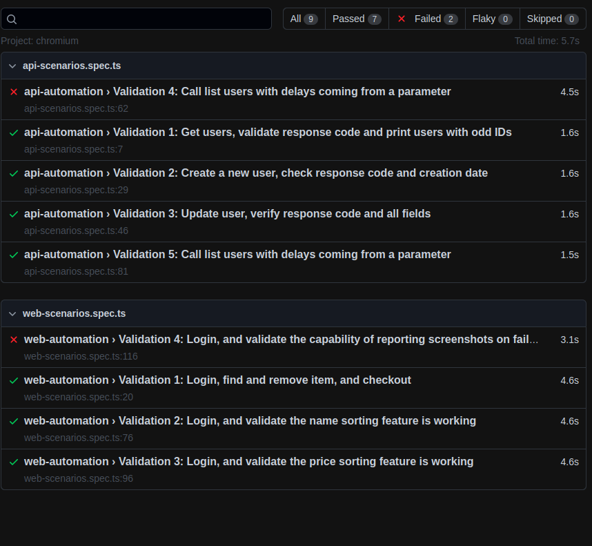
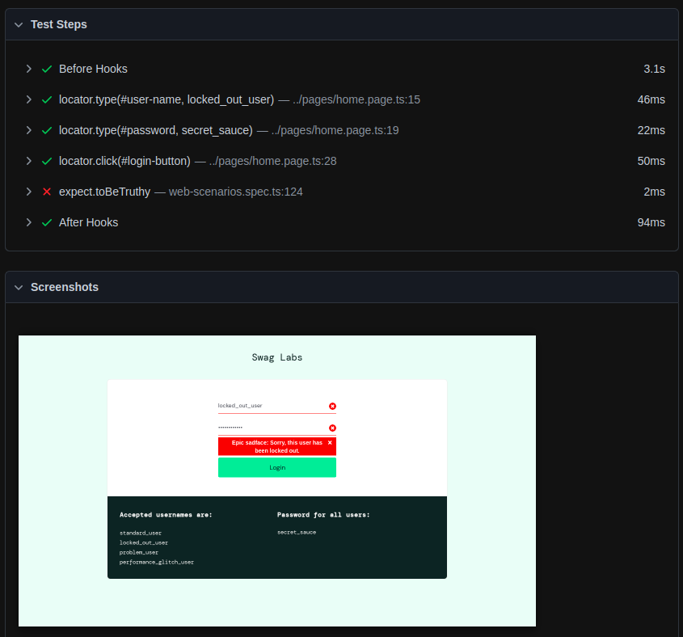
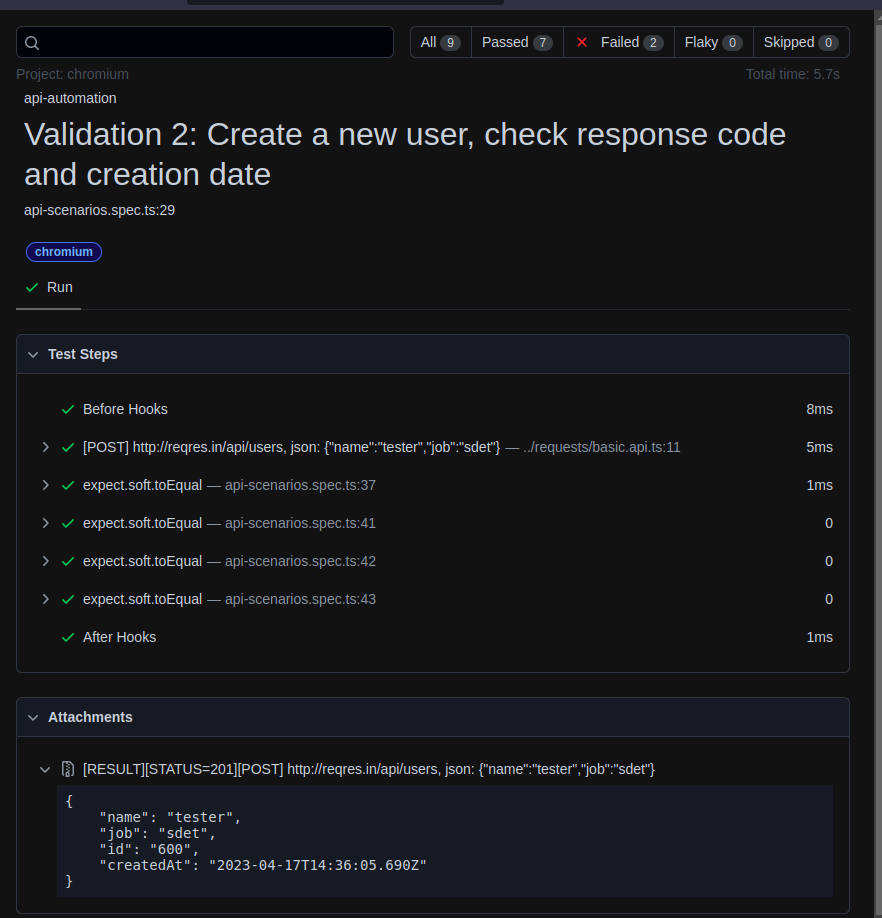

# playwright-experiment

This is the readme document regarding the project built to solve the web and api automation challenges.

## What the project is about

The main goal of this project is using the newest Playwright framework for solving a web and api automation challenges. I usually solve these challenges with Java + Selenium (for web/mobile automation) and Javascript or Typescript + Mocha (for api automation) or try to do a combination more suitable for the team or group.

## Why the language and tools selected
-   Typescript was selected due to a better Developer Experience on using Playwright;
-   `got.js` library was used to perform the API requests. There are some great alternative tools to use here, like axios, fetch or even the playwright request itself, but the `timings` feature is great for the delays verifications on scenario `Validation 4`;
-   `husky` is used for triggering the `precommit` verification. It triggers eslint and prettier to verify and beautify the code according to eslint standards. It is triggered by each commit locally (it is installed when cloning the repository). We can trigger this command by running `npm run format-code`.
-   Typescript Interfaces are used to serialize the body, function arguments, and for type checking;
-   `Joi` is used to deserialize and validate the schemas for the API responses

## How to set it up

### Pre-requirement

Make sure that Node.js is installed. If it is not installed, please reach out at https://nodejs.dev/en/download/. Basically, just need to install it and make sure that the option to update Path variable to support node.js installation is marked.

### Steps

1. Clone the [playwright-experiment](https://github.com/KelvinKSPS/playwright-experiment) repository or unpack the project zip file.
2. Open terminal and go to the folder where the project is unpacked.
3. Run `npm ci ` to download the dependencies.
4. Run `npx playwright install --with-deps` to install the playwright resources to run the automated tests against the test browsers.

## How to execute it

In order to run the automated tests:
i) To run all tests, please run `npx playwright test`. After that the report html will be opened automatically because 2 tests will fail - as expected.
ii) To run all tests on interactive mode, please run `npx playwright test --ui`.
iii) To run only the web automated tests, please run `npx playwright test web`.
iv) To run only the api automated tests, please run `npx playwright test api`.
v) In order to check the daily automated tests run, please check the [daily runs](https://github.com/KelvinKSPS/playwright-experiment/actions/).
vi) You can also trigger a run on github if you create any PR to the main branch at the github repository. The test report can be seen at the Artifacts section, like displayed on the next screenshot.


## How to develop for it

### Web Automation

The pattern used for Web Automation is the Page Object pattern.
To do that, just follow these steps:

1. Go to pages and create a new file. For example, new.page.ts.
2. Start your code like this:

```
import { Page } from '@playwright/test';
import BasicPage from './basic.page';

export default class NewPage extends BasicPage {
    constructor(public page: Page) {
        super(page);
        this.pageUrl = 'https://www.saucedemo.com/new-page.html';
        this.locators = {
            myLocator: page.locator(''#someid'),
        }
    }
}

```

-   The first two lines are imports for `Page` interface and `BasicPage` class;
-   `export default class NewPage extends BasicPage` is needed to inherit the basic properties from `BasicPage`. `NewPage` is an example for the new page;
-   `this.page` is needed to have the `validatePageUrl` working to identify if a page transiction happened properly. It must contain the current url for that page. If the page does not modify the url, an enhancement for identify a specific locator to assert that the page was changed is needed;
-   `this.locators` object must contain all locators for that page;
-   Any needed function should be created here to be used by the test file to do some actions (filling, clicking, hovering, etc).

3. Go to `web-scenarios.spec.ts` to add a test or step. Just import the new page and/or call the newest created methods.
4. Use `expect` from playwright to take advantage of verification options from playwright test manager.

-   If a new website should be automated using this project, a new folder called "saucelabs" should be created and all pages should be moved to this folder. After that, a new folder should be created for the new project and new pages should be created there. The `basic.page.ts` file should be let on `pages` folder. The same should be done for the `tests` folder, since the `api-scenarios` and `web-scenarios` are currently at the same folder. For multiple projects, the folder division would be great.

### API Automation

For developing new tests for this project, follow these steps:

1. Go to `reqres.api.ts` file inside requests folder.
2. Create a function following this format:

```
 async newFunction({anyParameter, pathParameter, queryParameter}: IExample) {
        const result = this.<method>(`<path>/${pathParameter}?test=${queryParameter}`, {
            json: {
                any_parameter: anyParameter
            },
        });
        this.assert(result.json, SSchemaExample);
        return result;
    }
```

-   `newFunction` should be the name of the function;
-   `method` should be the name of the HTTP Verb used for the call. It can be `GET`, `POST`, `PATCH`, `PUT`, `DELETE`, or `OPTIONS` for this project;
-   `<path>` should be the api path from reqres;
-   If a path parameter is required, this parameter can be received inside the json input for this function, as seen on `pathParameter` variable;
-   If a query parameter is required, this parameter can be received inside the json input for this function, as seen on `queryParameter` variable;
-   If a variable for body is required, this parameter can be received inside the json input for this function, as seen on `anyParameter` variable;
-   An interface called IExample is created to serialize the parameters and enhance the developer experience with auto-completion and type checking features. It could be created inside `interfaces/reqres.interface.ts`;
-   Remember that the three items above are optional and only required if the API requires these inputs. It can be single or multiple variables.
-   The Schema to test the deserialization should be placed inside `schemas/reqres.schemas.ts`. On this example, the name is `SSchemaExample`. The tool used for the schemas creation to validate when deserializing the API responses. The schemas can be reused and combined with other schemas.

```
export function SSchemaExample() {
    return Joi.object({
        text: Joi.string().required(),
        url: Joi.string().optional(),
        tester: Joi.string()    // also optional when the last option is hided
    })
}
```

-   If the deserialization validation fails, the test also _fails_. Joi can also be used for contract testing based on schemas;
-   The full response is returned - not only the json - because there are additional fields that some tests can use (timings, statusCode, headers, etc);

3. Go to `api-scenarios.spec.ts` to add a test or step. Just call the newest created methods.
4. Use `expect` from playwright to take advantage of verification options from playwright test manager. The API calls are being registered on the test report.

-   If a new API should be automated using this project, a new file should be created for the new project and new methods should be created there. The `basic.api.ts` file should be let on `requests` folder. The same should be done for the `tests` folder, since the `api-scenarios` and `web-scenarios` are currently at the same folder. For multiple projects, the folder division would be great.

## Reporting Details

This is how the report looks like:



-   2 of 9 tests are failing, like expected;
-   On the web automation section, when clicking on the failed test, it is possible to see the screenshot on the failed step:
    
-   Running on ui mode using `npx playwright test --ui`, it is possible to see all screenshots regarding to each step on web automation steps. So, it is possible to see the step by step transictions on how the web page reacts to each step;
-   On the api automation section, it is possible to check each API call made during the test. There is a minor issue on playwright where multiple API calls are grouped together - but does not affect that much on the report;
-   On the api automation section, all responses and status code are being stored inside `Attachments` section for a better debugging;
    
-   The `console.log` output can be also checked inside the Attachments section for the API `Validation 1`. For the scenario regarding the asynchronous verification it is also possible to check the orders that the apis are being called on each run.
